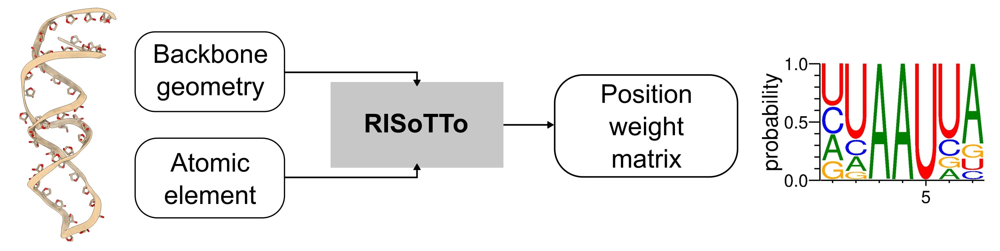

# RISoTTo

RISoTTo (RIbonucleic acid Sequence design from TerTiary structure) is a parameter-free geometric deep learning approach that generates RNA sequences conditioned on both their backbone scaffolds and the surrounding molecular context. This repository contains the inference code for generating RNA sequences that are predicted to fold into a given target structure.

## Overview

RISoTTo takes a 3D RNA structure (PDB format) as input and generates multiple RNA sequences that are predicted to fold into that structure.

## Installation

### Setup

Install dependencies:
```bash
pip install -r requirements.txt
```
make sure to install the compatible version of `PyTorch` and `cuda` for your system.

## Usage

```bash
python apply_model.py --pdb_filepath path/to/structure.pdb --output_dir ./output
```

```bash
python apply_model.py \
    --pdb_filepath path/to/structure.pdb \
    --output_dir ./output \
    --num_samples 5 \
    --imprint_ratio 0.5 \
    --sampling probabilistic \
    --device cuda:0
```
### Example

Test the installation with provided example:
```bash
python apply_model.py --pdb_filepath=test_pdb/1csl.pdb --output_dir=test_pdb/ --num_samples=5 --imprint_ratio=0.5 --device=cuda --sampling=max_confidence
```

### Parameters

- `--pdb_filepath` (required): Path to input PDB file containing RNA structure
- `--output_dir` (required): Directory to save output FASTA file
- `--num_samples` (default: 5): Number of additional sequences to generate beyond the max-confidence sequence
- `--imprint_ratio` (default: 0.5): Fraction of residues to constrain during sampling (0.0-1.0)
- `--sampling` (default: "max_confidence"): Sampling method ("probabilistic", "max_confidence")
- `--device` (default: "cuda:0"): Device for computation ("cuda:0", "cpu", etc.)

## Output Format

The tool generates a FASTA file containing designed sequences with metadata:

```
>seq_0 | recovery=0.536 confidence=0.937
GACGCCCGCGUAAUACAAUGGAGGGUUG
>seq_1 | recovery=0.500 confidence=0.972
GAAGCCCGCGUAAUACAAUGGAGGGUUG
```

## Example

Test the installation with provided examples:

```bash
# Design sequences for a tRNA structure
python apply_model.py --pdb_filepath=test_pdb/1csl.pdb --output_dir=test_pdb/ --num_samples=2 --imprint_ratio=0.5 --sampling=max_confidence --device=cuda
```

This will generate `test_pdb/1csl_designs.fasta` with the designed sequences.

## Train

If you want to train the model, first you need to download our ML ready dataset from this link [https://drive.google.com/file/d/1Ihp-RgOw6GUoTmV1lKFPmRRjOEMJZBH8/view?usp=sharing] and store it in the `datasets` directory.

To start training, run:

```bash
python main.py
```

### Optional dependencies

If you want to run secondary structure based forward folding validation, install EternaFold in the `software` directory from [https://github.com/eternagame/EternaFold].

Download weights for Ribonanzanet for chemical reactivity predictions from [https://drive.google.com/drive/folders/1rDMwn_CJ3usmBN0_V0dQU6xAaciFgTXT?usp=sharing]

## License

This work is licensed under a
[Creative Commons Attribution-NonCommercial-ShareAlike 4.0 International License][cc-by-nc-sa].

[![CC BY-NC-SA 4.0][cc-by-nc-sa-image]][cc-by-nc-sa]

[cc-by-nc-sa]: http://creativecommons.org/licenses/by-nc-sa/4.0/
[cc-by-nc-sa-image]: https://licensebuttons.net/l/by-nc-sa/4.0/88x31.png
[cc-by-nc-sa-shield]: https://img.shields.io/badge/License-CC%20BY--NC--SA%204.0-lightgrey.svg

## Reference
Bibekar, P., Krapp, L. F., & Dal Peraro, M. (2025). Context-aware geometric deep learning for RNA sequence design. bioRXiv https://doi.org/10.1101/2025.06.21.660801
